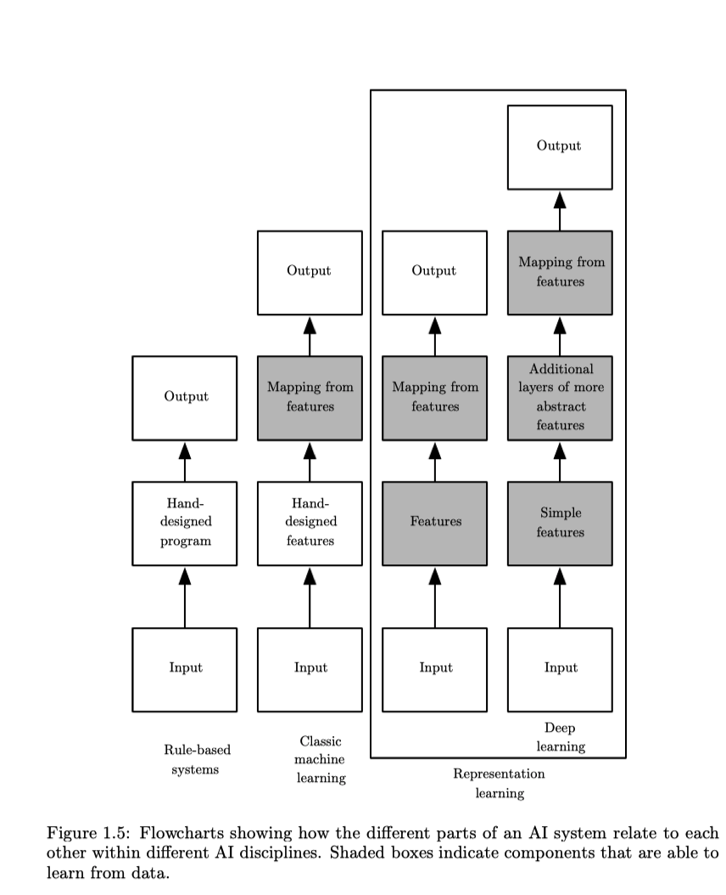
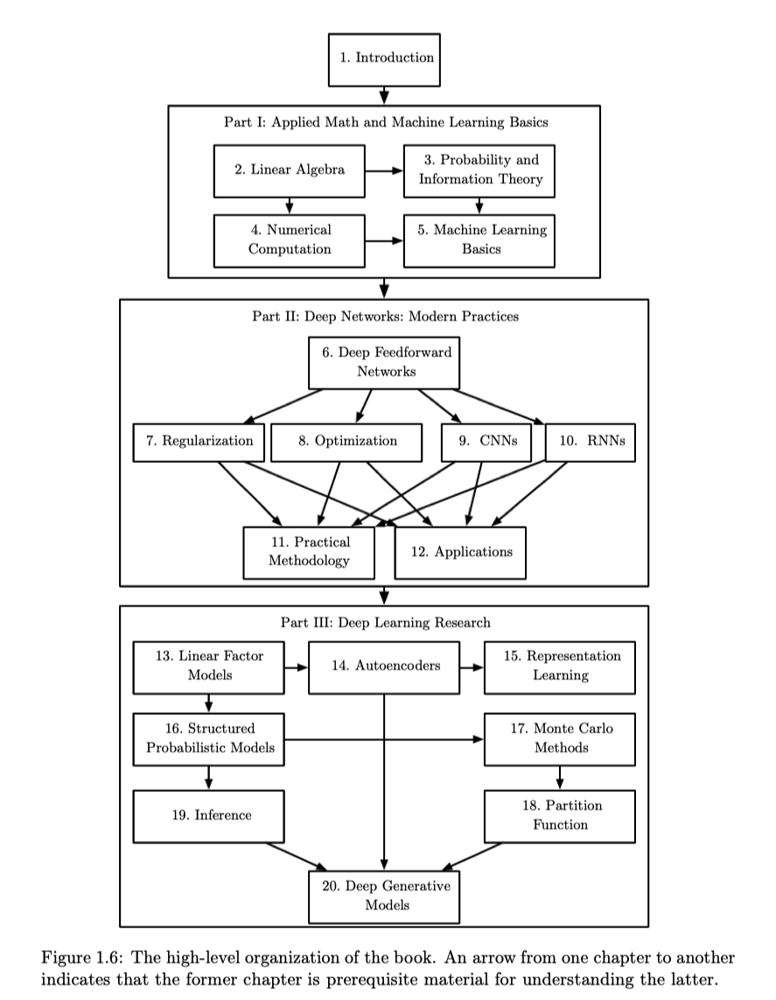

1. A computer is **knowledge based** artificial intelligence which means that it can reason about statements in therese formal languages automatically using logical inference rules.

2. The ability that AI systems has to acquire their own knowledge by extracting patterns from raw data is known as **machine learning**.

3. The performance of simple machine learning algorithms depends heavily on the *representation* of the data they are given. However, for many tasks, it is difficult to know what ffeatures should be extracted. One solution is to use machine learning to discover not only *the mapping from representation to output* but also *the representation itself*. This approach is known as **representation learning**.
> *Autoencoder* is the combination of an *encoder* function that converts the input data into a different representation, and a *decoder* function that converts the new representation back into the original format. Autoencoders are trained to preserve as much information as possible when an input is run through the encoder and then the decoder, but are also trained to make the new representation have various nice properties. 

4. When designing features or algorithms for learning features, our goal is usually to separate the *factor of variation* that explain the observed data. We use word **factor** refers to separate sources of influence. 

5. **Deep learning** solves the sophisticated problem in representations learning by introducing representations that are expressed in terms of other, simpler represantations. 

6. Two ways of measuring the **depth of a model** are *the number of sequential instructions that must be executed to evaluate the architecture* (the depth of the computational graph, 2 times) or *the depth of the probabilistic modeling graph* (2n times).

# Deep learning history
1. Three waves of development: *cybernetics* in the 1940s-1960s; *connectionism* in the 1980s-1990s; *deep learning* in 2006.
